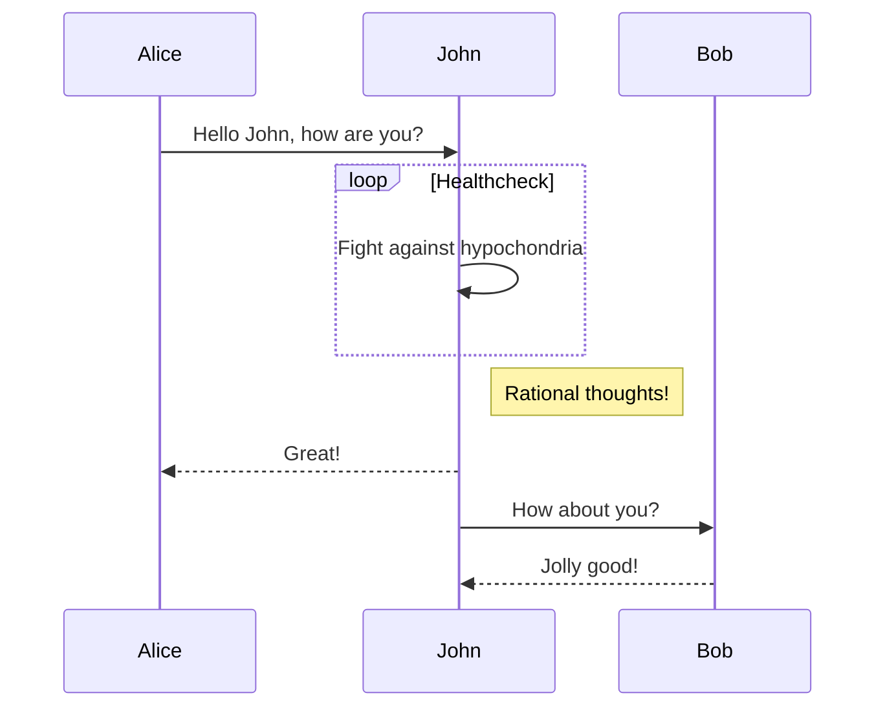

---
tags: [demo, mm-docs system, test]
---
# Demonstration page

[mm-docs](https://github.com/majkinetor/mm-docs) demonstration page.

For more details about included tools see:

- [Mkdocs](https://www.mkdocs.org)
- [Mkdocs Material Extensions](https://squidfunk.github.io/mkdocs-material/extensions/admonition)
- [PlantUML](http://plantuml.com)
- [MathJax](https://www.mathjax.org/)
- [Jinja](https://jinja.palletsprojects.com)

## Customization

- [Color palettes](https://squidfunk.github.io/mkdocs-material/getting-started/#color-palette)
- [Language](https://squidfunk.github.io/mkdocs-material/getting-started/#language)
- [Extending theme](https://squidfunk.github.io/mkdocs-material/customization/#extending-the-theme)

## Text

**Unicode**: Мислим дакле постојим

### Basic effects

|       Output       |                Code                |
| ------------------ | ---------------------------------- |
| **Bold text**      | `**Bold text**` or `__Bold text__` |
| *Italic text*      | `*Italic text*` or `_Italic text_` |
| ~~Strike Through~~ | `~~Strike Through~~`               |
| ==Colored text==   | `==Colored text==`                 |
| `Inline code`      | <code>\`Inline code\`</code>       |


Subscript and supscript:

```md
- H~2~0
- A^T^A
```

- H~2~0
- A^T^A

## Buttons

```md title="Adding button"
[Subscribe to our newsletter](#){ .md-button }
```

[Subscribe to our newsletter :fontawesome-solid-paper-plane:](#){ .md-button }


## Local files and images

```md

```


To align image and add some text next to it you must put in div with class `result`:

```md title="Aligned image"
<div class="result" markdown>
{ align=left }
</div>
```

<div class="result" markdown>
{ align=left }

Some OMG cat is displayed here.

Some more text here...
</div>

### Hotkeys

|         Output         |           Code           |
| ---------------------- | ------------------------ |
| ++enter++              | `++enter++`              |
| ++"PgDown"++           | `++"PgDown"++`           |
| ++"Non Existent Key"++ | `++"Non Existent Key"++` |

## Links, footnotes and comments

### Links

|                                    Output                                     |                                                    Code                                                     |
| ----------------------------------------------------------------------------- | ----------------------------------------------------------------------------------------------------------- |
| [An inline-style link](https://www.google.com)                                | `[An inline-style link](https://www.google.com)`                                                            |
| [An inline-style link with title](https://www.google.com "Google's Homepage") | `[An inline-style link with title](https://www.google.com "Google's Homepage")`                             |
| [Reference-style link][arbitrary reference text]                              | `[Reference-style link][arbitrary reference text]`<br>`[arbitrary reference text]: https://www.mozilla.org` |
| [Relative reference to a repository file](../about/overview)                  | `[Relative reference to a repository file](../about/overview)`                                              |
| [Numbers for reference-style link definitions][1]                             | `[Numbers for reference-style link definitions][1]`<br>`[1]: http://slashdot.org`                           |
| Use the [link text itself]                                                    | `Use the [link text itself]`<br>`[link text itself]: http://www.reddit.com`                                 |

[arbitrary reference text]: https://www.mozilla.org
[1]: http://slashdot.org
[link text itself]: http://www.reddit.com

**Magic links and emails:** turned to links as recognized

|        Output         |          Code           |
| --------------------- | ----------------------- |
| http://www.google.com | `http://www.google.com` |
| majkinetor@gmail.com  | `majkinetor@gmail.com`  |
| www.google.com        | `www.google.com`        |


### Footnotes

```md
A text with a short footnote[^short]
[^short]: https://en.wikipedia.org/wiki/Note_(typography)
```

A text with a short footnote[^short]
[^short]: https://en.wikipedia.org/wiki/Note_(typography)

---

```md
A text with a long footnote[^long]
[^long]:
    Lorem ipsum dolor sit amet, consectetur adipiscing elit. Nulla et euismod
    massa, nec semper lorem quam in massa.

    ```
    code
```

A text with a long footnote[^long]
[^long]:
    Lorem ipsum dolor sit amet, consectetur adipiscing elit. Nulla et euismod
    massa, nec semper lorem quam in massa.

    ```
    code
    ```

### Comments

```
The text contains 2 comments bellow this line which should not be visible.
[comment]: # (Developed using Visual Studio Code with plantuml extension: cinst visualstudiocode; code --install-extension jebbs.plantuml)
[comment]: # (PlantUML version may influence diagrams. This document is developped with 1.2017.15: cinst plantuml --version 1.2017.15)
```

The text contains 2 comments bellow this line which should not be visible.

[comment]: # (Developed using Visual Studio Code with plantuml extension: cinst visualstudiocode; code --install-extension jebbs.plantuml)
[comment]: # (PlantUML version may influence diagrams. This document is developped with 1.2017.15: cinst plantuml --version 1.2017.15)

## Citations

> Lorem ipsum dolor sit amet, consectetur adipiscing elit. Nulla et euismod nulla. Curabitur feugiat, tortor non consequat finibus, justo purus auctor  massa, nec semper lorem quam in massa.
> Inline:
> > Lorem ipsum dolor sit amet, consectetur adipiscing elit. Nulla et euismod nulla. Curabitur feugiat, tortor non consequat finibus, justo purus auctor  massa, nec semper lorem quam in massa.
> ```
> code in citations
> ```
> Another citation line

## HTML

HTML is allowed without restrictions. Custom styles are added in `docs\_css\extra.css` file.

```html
<div style='background-color: #fdd; padding:1em; text-align: center '>
    <font size="20">
        <span class="yellow bred pl1 pr1">cookies</span>
    </font>
</div>
```

<div style='background-color: #fdd; padding:1em; text-align: center '>
    <font size="20">
        <span class="yellow bred pl1 pr1">cookies</span>
    </font>
</div>


## Critic and comments

Here is some {--*incorrect*--} Markdown.  I am adding this{++ here++}.  Here is some more {--text that I am removing--}text.  And here is even more {++text that I  am ++}adding.
{~~

~>  ~~}Paragraph was deleted and replaced with some spaces.{~~  ~>

~~}Spaces were removed and a paragraph was added.

And here is a comment on {==some text==}{>>This works quite well. I just wanted to comment on it.<<}. Substitutions {~~ is~>are~~} great!

General block handling:

{--

* test remove
* test remove

--}

{++

* test add
* test add

++}


## Emoji and icons

Use more than 7.000 icons and thousands of emojis in your project documentation with zero effort. Custom icons can be added and used in `mkdocs.yml`, documents and templates.

- [More info](https://squidfunk.github.io/mkdocs-material/reference/icons-emojis/#icons-emojis)
- [List of emoji codes](https://web.archive.org/save/https://www.webfx.com/tools/emoji-cheat-sheet/)

- `:tada:` :tada:
- `:jack_o_lantern:` :jack_o_lantern:
- `:alien:` :alien:
- `:robot_face:` :robot_face:
- `:smile:` :smile:
- `:heart:` :heart:
- `:thumbsup:` :thumbsup:

:purple_heart: :exclamation: :clock1: :tractor: :chicken: :imp:

- :material-account-circle:  – `:material-account-circle:` --> `.icons/material/account-circle.svg`
- :fontawesome-regular-laugh-wink: – `:fontawesome-regular-laugh-wink:` --> `.icons/fontawesome/regular/laugh-wink.svg`

[:octicons-file-code-24: Source](#1)


## Lists

### Ordered list

1. List item 1
2. List item 2
    1. List item 2.1
    2. List item 2.2
        1. List item 2.2.1
        2. List item 2.2.2
    3. List item 2.3
3. List item 4

### Unordered, mixed

- List item 1
- List item 2
    - List item 2.1
    - List item 2.2
        1. List item 2.2.1
        1. List item 2.2.2
    - List item 2.3
- List item 4

## Tables

|  Col1  |         Col2         |
| ------ | -------------------- |
| row1.1 | row1.2               |
| row2.1 | row2.2-1<br>row2.2-2 |

## Plantuml

Add `plantuml` in a block code header to set code section as PlantUml source. Use `format` to specify output type:

<pre>
``&#x60;plantuml format="svg"
title PlantUml Demo
left to right direction
skinparam packageStyle rectangle
actor customer
actor clerk
rectangle checkout {
  customer -- (checkout)
  (checkout) .> (payment) : include
  (help) .> (checkout) : extends
  (checkout) -- clerk
}
``&#x60;
</pre>

```plantuml format="svg"
title PlantUml Demo
left to right direction
skinparam packageStyle rectangle
actor customer
actor clerk
rectangle checkout {
  customer -- (checkout)
  (checkout) .> (payment) : include
  (help) .> (checkout) : extends
  (checkout) -- clerk
}
```

## Mermaid

<pre>
``&#x60;mermaid
sequenceDiagram
  Alice->>John: Hello John, how are you?
  loop Healthcheck
      John->>John: Fight against hypochondria
  end
  Note right of John: Rational thoughts!
  John-->>Alice: Great!
  John->>Bob: How about you?
  Bob-->>John: Jolly good!
``&#x60;
</pre>



## MathJax

The block code:

<pre>
``&#x60;
$$
\frac{n!}{k!(n-k)!} = \binom{n}{k}
$$
``&#x60;
</pre>

$$
\frac{n!}{k!(n-k)!} = \binom{n}{k}
$$

---

`Inline math expressions: $p(x|y) = \frac{p(y|x)p(x)}{p(y)}$`

Inline math expressions: $p(x|y) = \frac{p(y|x)p(x)}{p(y)}$


**NOTE**:

- This doesn't render corretly in PDF output, see [this](https://github.com/zhaoterryy/mkdocs-pdf-export-plugin/issues/18) issue for explanation.


## Admonition

[More info](https://squidfunk.github.io/mkdocs-material/extensions/admonition/)

!!! note
    Lorem ipsum dolor sit amet, consectetur adipiscing elit. Nulla et euismod
    nulla. Curabitur feugiat, tortor non consequat finibus, justo purus auctor
    massa, nec semper lorem quam in massa.

??? question "Collapsed closed"
    Lorem ipsum dolor sit amet, consectetur adipiscing elit. Nulla et euismod
    nulla. Curabitur feugiat, tortor non consequat finibus, justo purus auctor
    massa, nec semper lorem quam in massa.

???+ question "Collapsed open"
    Lorem ipsum dolor sit amet, consectetur adipiscing elit. Nulla et euismod
    nulla. Curabitur feugiat, tortor non consequat finibus, justo purus auctor
    massa, nec semper lorem quam in massa.

!!! danger "Extreme danger"
    Lorem ipsum dolor sit amet, consectetur adipiscing elit. Nulla et euismod
    nulla. Curabitur feugiat, tortor non consequat finibus, justo purus auctor
    massa, nec semper lorem quam in massa.

    ```
    some code
    ```

    > Some citation

## Code Highlight

[More info](https://squidfunk.github.io/mkdocs-material/reference/code-blocks)

```python
import tensorflow as tf
```

With tabs:

=== "Bash"

    ```bash
    #!/bin/bash

    echo "Hello world!"
    ```

===  "PowerShell"

    ```powershell
    Write-Host "Hello world!"
    ```

=== "PlantUML"

    ```plantuml
    Bob -> Alice : Hello world!
    ```

=== "C"

    ```c
    #include <stdio.h>

    int main(void) {
      printf("Hello world!\n");
    }
    ```

=== "C++"

    ```c++ hl_lines="3"
    #include <iostream>

    int main() {
      std::cout << "Hello world!" << std::endl;
      return 0;
    }
    ```

=== "C#"

    ```c#
    using System;

    class Program {
      static void Main(string[] args) {
        Console.WriteLine("Hello world!");
      }
    }
    ```

## Abbreviations

The following are defined in single file, `_inc\abbr.md` and included on each page.

- IT, XML, JSON

## Smart symbols

- `(tm)` (tm)
- `(c)`	(c)
- `c/o`	c/o
- `+/-` +/-
- `-->` -->
- `<--` <--
- `<-->` <-->
- `=/=` =/=
- `1/4` 1/4
- `1st` 1st

## Task list

* [x] Lorem ipsum dolor sit amet, consectetur adipiscing elit
* [x] Curabitur elit nibh, euismod et ullamcorper at, iaculis feugiat est
* [ ] Vestibulum convallis sit amet nisi a tincidunt
    * [x] In hac habitasse platea dictumst
    * [ ] Praesent sed risus massa
* [ ] Nulla vel eros venenatis, imperdiet enim id, faucibus nisi

## Macros

[More details](https://github.com/fralau/mkdocs_macros_plugin#overview).



|                                        |                                                         |
| -------------------------------------- | ------------------------------------------------------- |
| Variable from config                   | `extra.version = {{version}}`                           |
| Variable from this page                | `acme = {{acme}}`                                       |
| Macro (defined in `main.py`)           | `bar(1) = {{ bar(1) }}` - `barbaz(3) = {{ barbaz(3) }}` |
| Python variable (defined in `main.py`) | `baz = {{ baz }}`                                       |
| Dictionary variable from config        | `company.name = {{ company.name }}`                     |

## Jinja templates

You can do all the work you want with Jinja2, including defining pure macros, conditionals and for loops:

<pre>
{&#x25; macro input(name, value='', type='text', size=20) -%}
  &lt;input type="{&#123; type }}" name="{&#123; name }}" value="{&#123; value}}" size="{&#123; size }}">
{&#x25;- endmacro %}

{&#x25; input('username') }}
{&#x25; input('password', type='password') }}
</pre>

## Includes

You may use the include directive from jinja2, directly in your markdown code e.g.:

<pre>
## Paragraph
{&#x25;include 'snippet.md' %}
{&#x25;include 'html/content1.html' %}
</pre>

The root directory for your included files is in `docs_dir`.

You can also include [parts of the file](https://mkdocs-macros-plugin.readthedocs.io/en/latest/tips/#i-would-like-to-include-a-text-file-from-line-a-to-line-b).

## Environment variables

Environment variables can be used inside of configuration file `mkdocs.yaml`. [More...](https://www.mkdocs.org/user-guide/configuration/#environment-variables)

```
site_name: !ENV CI_PROJECT_PATH
```


